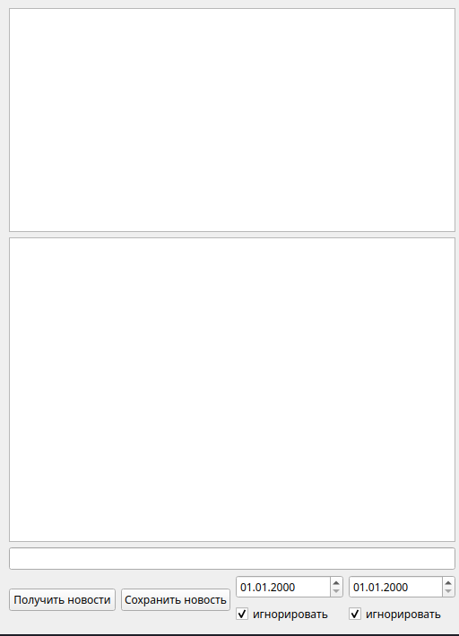
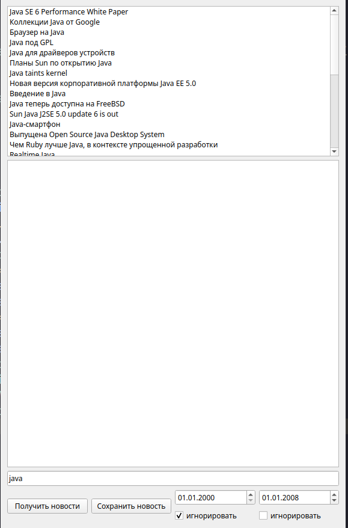

# Приложение для чтения новостей с сайта linux.org.ru

## О приложении ##

Данноe приложение позволяет читать новости c linux.org.ru по опреденному тегу, выбирать новости по дате и сохранять.

## Интерфейс ##

>Интерфейс главного окна

>Открыта новость и получены все новости с тегом "Python"

>Получены все новости с тегом "java", созданные раньше 01.01.2008.
