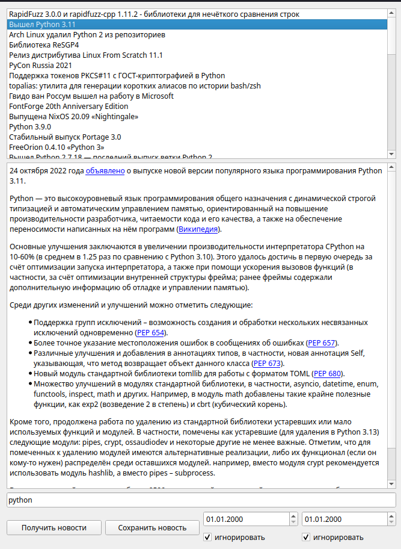

# Приложение для чтения новостей с сайта linux.org.ru

## О приложении ##

Данноe приложение позволяет читать новости c linux.org.ru по опреденному тегу, выбирать новости по дате и сохранять.

## Интерфейс ##

>Интерфейс главного окна

>Открыта новость и получены все новости с тегом "Python"

>Получены все новости с тегом "java", созданные раньше 01.01.2008.

Для того чтобы начать работу с программой.
* Cкачайте все файлы с расширеннием .py в одну директорию
* Установите перечисленные ниже модули
* Запустите файл "main.py"

***
Использованные модули
* PySyde6
* BeautifulSoup
* Requests
* re
* dataclasses
* sys
* itertools

Работу выполнял: [Титилин Александр](https://github.com/AlexanderTitilin)
